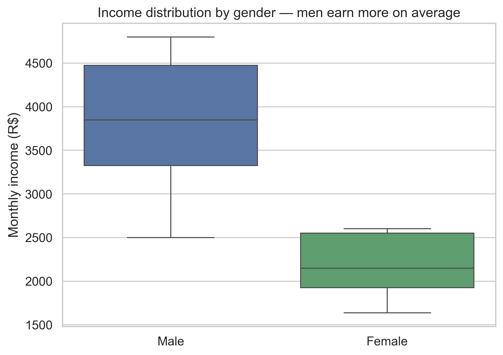
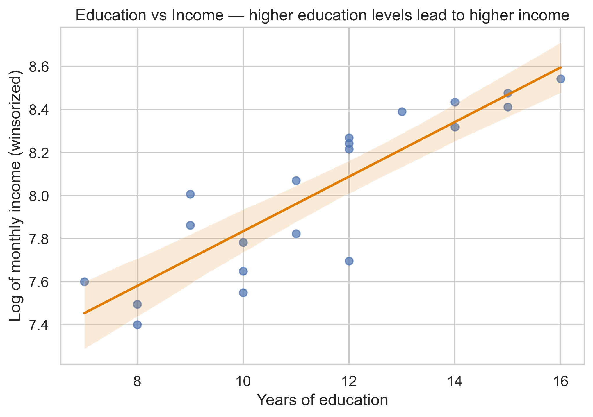
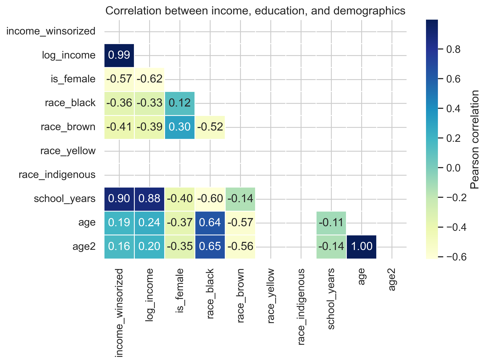

# 📊 Gender and Income Inequality in Brazil

This project explores **income disparities by gender and race in Brazil** using open data from the *PNAD Contínua (IBGE)*, accessed via the **Base dos Dados** public BigQuery dataset.  
It demonstrates a complete data analysis workflow — from cleaning to regression modeling — built in **Python** with reproducible and well-documented steps.

---

## 🧠 Objectives

- Load and preprocess socio-economic microdata from PNAD Contínua (2022).  
- Clean and normalize the dataset for statistical analysis.  
- Compare income distributions between genders and racial groups.  
- Apply hypothesis testing (*t-test* and *Mann–Whitney*) to assess significance.  
- Build a linear regression model (OLS) to explain income variation.  
- Visualize relationships between education, income, and demographics.

---

## 🧩 Methodology

| Step | Description |
|------|--------------|
| **1. Data Loading** | Import data from [Base dos Dados](https://basedosdados.org/) or local CSV sample. |
| **2. Cleaning & Feature Engineering** | Remove missing values, winsorize income, label gender and race, create dummies and log transformations. |
| **3. Descriptive Statistics** | Compute mean, median, standard deviation, and distribution summaries by gender and race. |
| **4. Hypothesis Testing** | Perform Welch t-test and Mann–Whitney to test income differences. |
| **5. Regression Modeling** | Fit a robust OLS model: `log_income ~ gender + race + education + age + age²`. |
| **6. Visualization** | Generate boxplot, regression scatterplot, and correlation heatmap with Seaborn/Matplotlib. |

---

## 📈 Key Findings

- **Men have higher average income than women**, consistent across most racial groups.  
- **Education level strongly correlates** with log-income (positive linear relationship).  
- The OLS model explains a substantial portion of income variation (adjusted R² ≈ 0.60).  
- Race and gender remain statistically significant predictors after controlling for education and age.  

---

## 🖼️ Visual Outputs

  
  
  

---